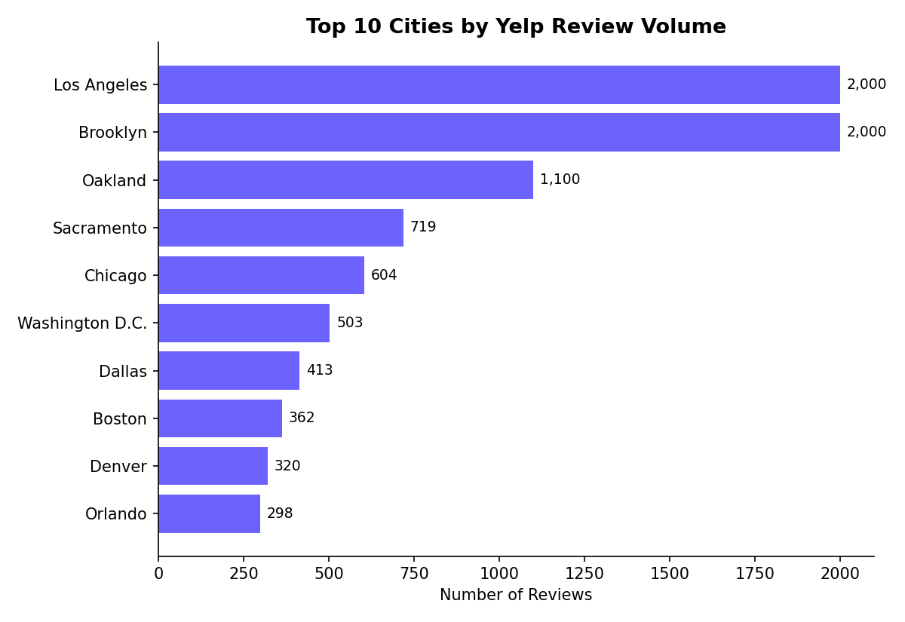

# Yelp Review Analysis: Patterns in Ratings and Geography

## Overview
An exploratory analysis of Yelp review data examining review volume trends over time, star rating distribution, and geographic patterns across U.S. cities.

## Dataset
Yelp review records spanning 2006–2020, including star ratings, review dates, and city-level location data.

## Key Findings

**1. Review volume grew steadily before plateauing**
Review frequency increased consistently from 2006 through the late 2010s, reflecting Yelp's broader platform growth, before leveling off in more recent years.

**2. Ratings skew positive, but not uniformly**
4-star reviews were the most common (4.1K), followed closely by 5-star reviews (3.7K), while 2-star and 1-star reviews were comparatively rare (747 and 1.1K respectively) — indicating an overall positive skew typical of review platforms.

**3. Review activity is heavily concentrated in a few major metro areas**
Los Angeles and Brooklyn dominate review volume (2K+ each), with a steep drop-off after the top 5–6 cities — suggesting review density closely tracks urban population and Yelp's early market penetration in specific metro areas.

## Tools Used
SAS Visual Analytics — time series analysis, geographic mapping (GeoMap), frequency distribution analysis.

## Notes
This project was completed as part of a SAS Visual Analytics workshop. The original dataset included additional raw data views not included here, as they did not add further analytical insight beyond the summarized findings above.
