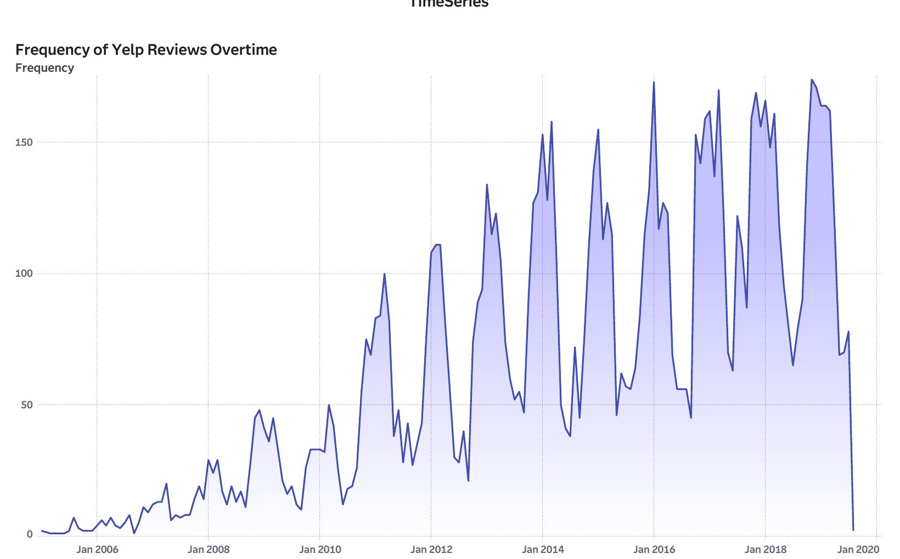
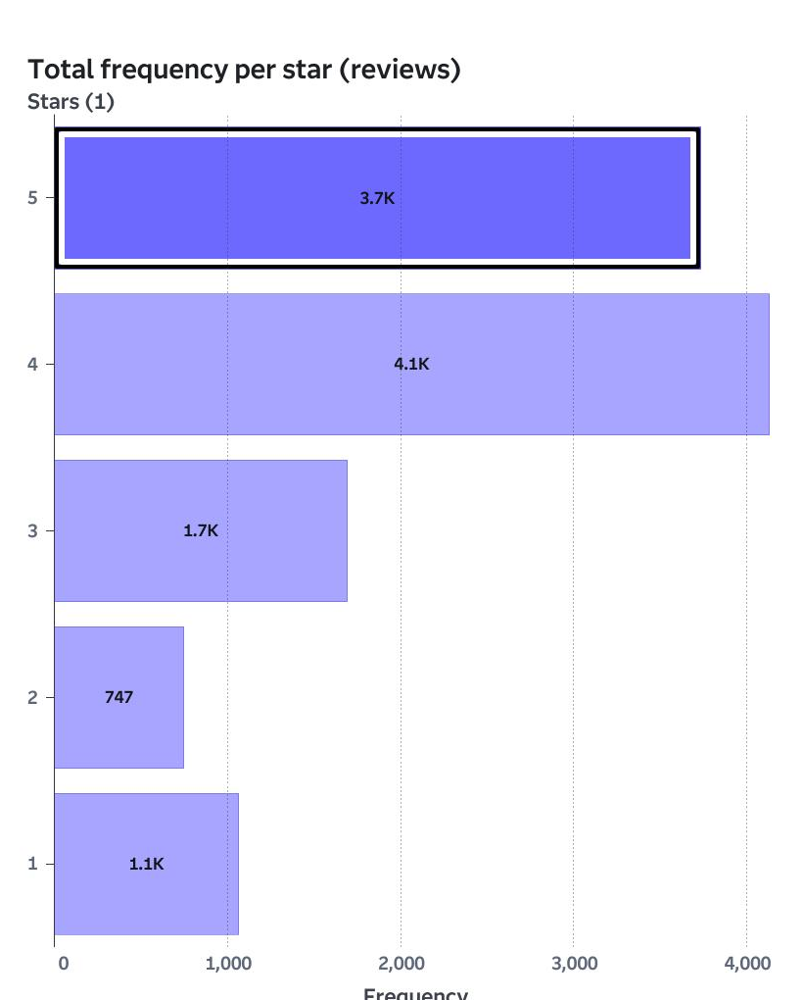
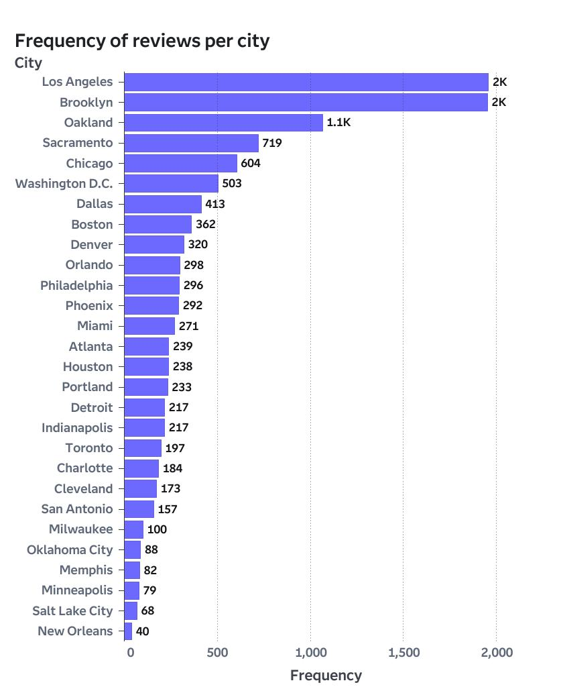
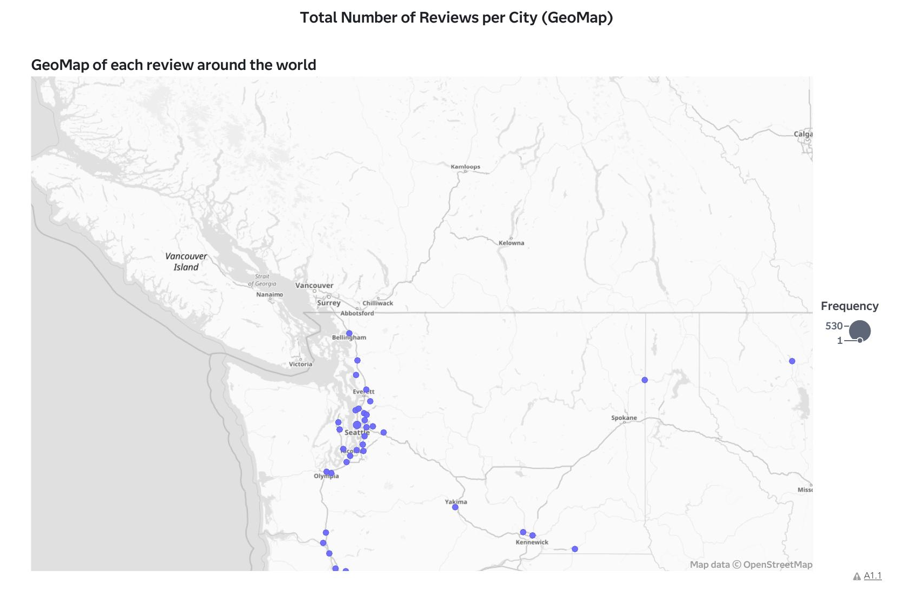
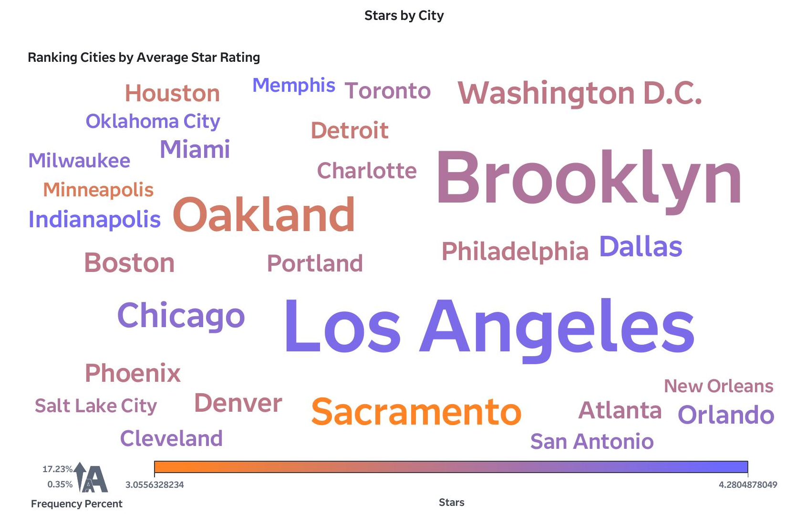
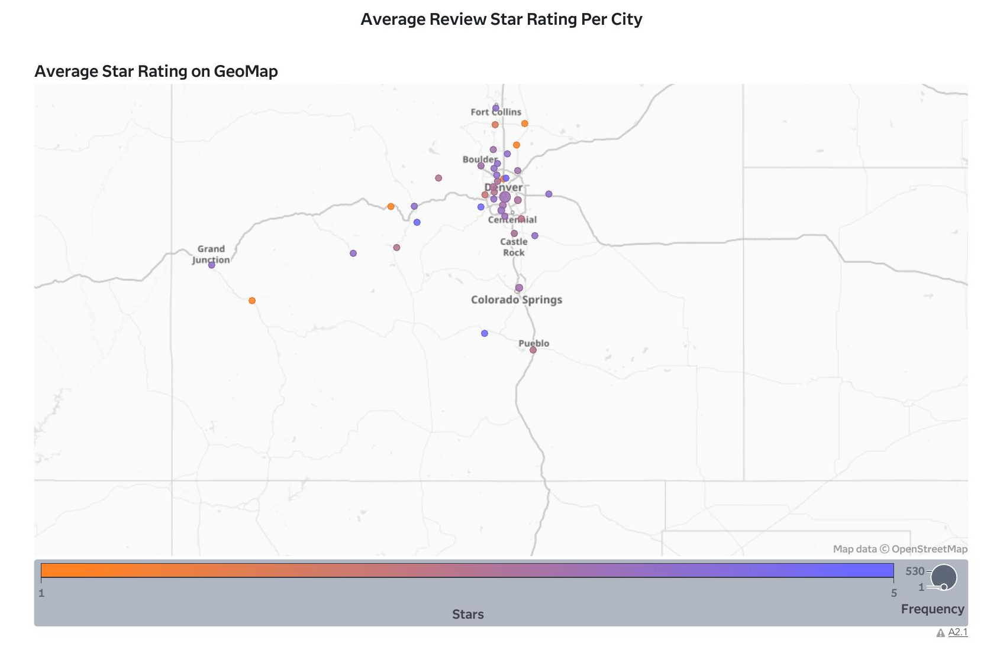

# Yelp Review Analysis: Patterns in Ratings and Geography

## Overview
An exploratory analysis of Yelp review data examining review volume trends over time, star rating distribution, and geographic patterns across U.S. cities.

## Dataset
Yelp review records spanning 2006–2020, including star ratings, review dates, and city-level location data.

## Key Findings

**1. Review volume grew steadily before plateauing**
Review frequency increased consistently from 2006 through the late 2010s, reflecting Yelp's broader platform growth, before leveling off in more recent years.

**2. Ratings skew positive, and review volume is concentrated in a handful of cities**
4-star reviews were the most common (4.1K), followed closely by 5-star reviews (3.7K), while 2-star and 1-star reviews were comparatively rare (747 and 1.1K respectively) — indicating an overall positive skew typical of review platforms. Review volume itself is heavily concentrated as well, with Los Angeles and Brooklyn dominating at roughly 2K reviews each, followed by a steep drop-off after the top 5–6 cities.

**3. Review activity is geographically concentrated in the Pacific Northwest**
The GeoMap of total reviews shows review activity clustered heavily around the Seattle metro area, with a scattering of additional data points across Washington and the broader region.

**4. Average star ratings vary by city, independent of review volume**
Ranking cities by average star rating shows Los Angeles, Brooklyn, and Sacramento standing out with notably higher average ratings, while other high-volume cities like Chicago and Miami show more moderate average scores — suggesting rating quality doesn't necessarily track with review quantity.

**5. A closer regional view highlights rating variation within Colorado**
A second GeoMap, focused on the Colorado region, shows average star rating by exact location, with color indicating rating and size indicating review frequency — revealing localized pockets of both higher- and lower-rated businesses within the same metro area.

## Tools Used
SAS Visual Analytics — time series analysis, geographic mapping (GeoMap), frequency distribution analysis.

## Notes
This project was completed as part of a SAS Visual Analytics workshop. A raw data preview table included in the original report was excluded here, as it was truncated by a query row limit and added no further analytical insight beyond the summarized findings above. The second GeoMap (Finding 5) is scoped to the Colorado region specifically, rather than the full national dataset.
